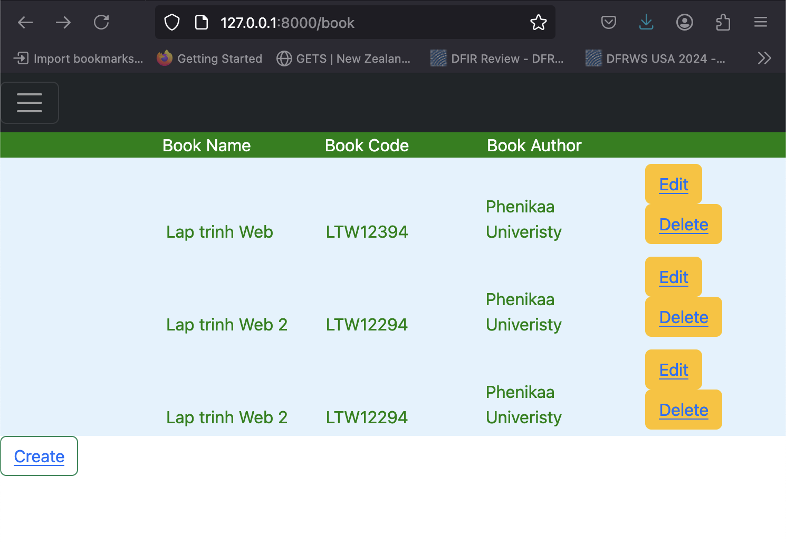

# Create Web project

```
 composer create-project --prefer-dist laravel/laravel bookManagement

```


# Run Project
 
```
php artisan serve
```

# Eloquent Technique

## Create model

```

php artisan make:model Book
```

Model will be in app/Models
Modify model Book as below

```
<?php

namespace App\Models;

use Illuminate\Database\Eloquent\Model;
use Illuminate\Database\Eloquent\Factories\HasFactory;

use Illuminate\Notifications\Notifiable;

class Book extends Model
{
     /** @use HasFactory<\Database\Factories\UserFactory> */
     use HasFactory, Notifiable;

     /**
      * The attributes that are mass assignable.
      *
      * @var list<string>
      */
     protected $fillable = [
         'bookName',
         'bookCode',
         'bookAuthor',
     ];
 
}

```


## Create table Book 

```
php artisan make:migration create_books_table

```

### Method Up()

create book

```
 public function up(): void
    {
        Schema::create('books', function (Blueprint $table) {
            $table->id();
            $table->timestamps();
            $table->string('bookName');
            $table->string('bookCode');
            $table->string('bookAuthor');
        });
    }
```


### Method down()

```
public function down(): void
    {
        Schema::dropIfExists('books');
    }
```

## Local Seeding data

Update DatabaseSeeder.php

```
use Illuminate\Database\Seeder;

class DatabaseSeeder extends Seeder
{
    /**
     * Seed the application's database.
     */
    public function run(): void
    {
        // User::factory(10)->create();

        User::factory()->create([
            'name' => 'Test User',
            'email' => 'test@example.com',
        ]);

        Book::create([
          
            'bookName' => 'Advance Web',
            'bookCode' => 'AW12398',
            'bookAuthor' => 'Laravel',
        ]);
    }
}

```


to create data for Book

## Run

```
php artisan key:generate
php artisan migrate
php artisan db:seed
```

code response without errors

```
@nglthu ➜ /workspaces/webDevContainer/bookManagement (main) $ php artisan key:generate
Xdebug: [Step Debug] Could not connect to debugging client. Tried: localhost:9000 (through xdebug.client_host/xdebug.client_port).

   INFO  Application key set successfully
***
.  

Xdebug: [Step Debug] Could not connect to debugging client. Tried: localhost:9000 (through xdebug.client_host/xdebug.client_port).
@nglthu ➜ /workspaces/webDevContainer/bookManagement (main) $ php artisan migrate
Xdebug: [Step Debug] Could not connect to debugging client. Tried: localhost:9000 (through xdebug.client_host/xdebug.client_port).

   INFO  Running migrations.  

  2025_05_07_123744_create_books_table ................................................................................................. 6.25ms DONE

Xdebug: [Step Debug] Could not connect to debugging client. Tried: localhost:9000 (through xdebug.client_host/xdebug.client_port).
@nglthu ➜ /workspaces/webDevContainer/bookManagement (main) $ php artisan db:seed
Xdebug: [Step Debug] Could not connect to debugging client. Tried: localhost:9000 (through xdebug.client_host/xdebug.client_port).

   INFO  Seeding database.  
```

# Model View Controller

## Controller

```
php artisan make:Controller BookController
```

Display all books

```
<?php

namespace App\Http\Controllers;

use Illuminate\Http\Request;
use App\Models\Book;
class BookController extends Controller
{
    public function index(){
        $books = Book::all();
        return view('Book', compact('books'));
    }
}
```


## View

```
php artisan make:View Book
```

Simple html

```
<thead>
        <tr>
        <th>Book</th>
        </tr>
      
</thead>
<tbody>
        {{$books}}
        
</tbody>

```


## Model


```
<?php

namespace App\Models;

use Illuminate\Database\Eloquent\Model;
use Illuminate\Database\Eloquent\Factories\HasFactory;

use Illuminate\Notifications\Notifiable;

class Book extends Model
{
     /** @use HasFactory<\Database\Factories\UserFactory> */
     use HasFactory, Notifiable;

     /**
      * The attributes that are mass assignable.
      *
      * @var list<string>
      */
     protected $fillable = [
         'bookName',
         'bookCode',
         'bookAuthor',
     ];
 
}

```


## Route

```
Route::get('book', [BookController::class, 'index']);

```

# Ouput


 
